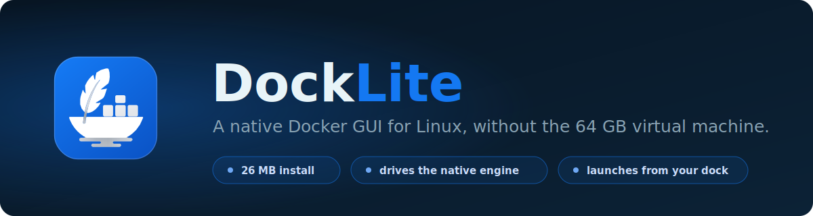
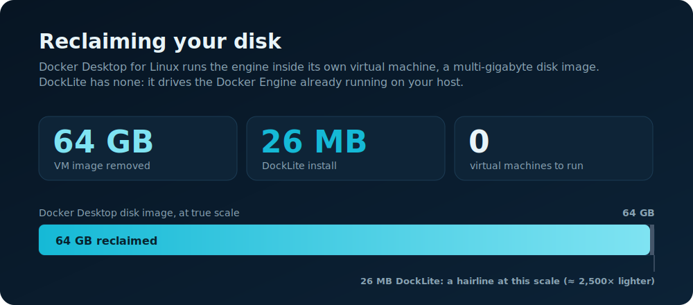
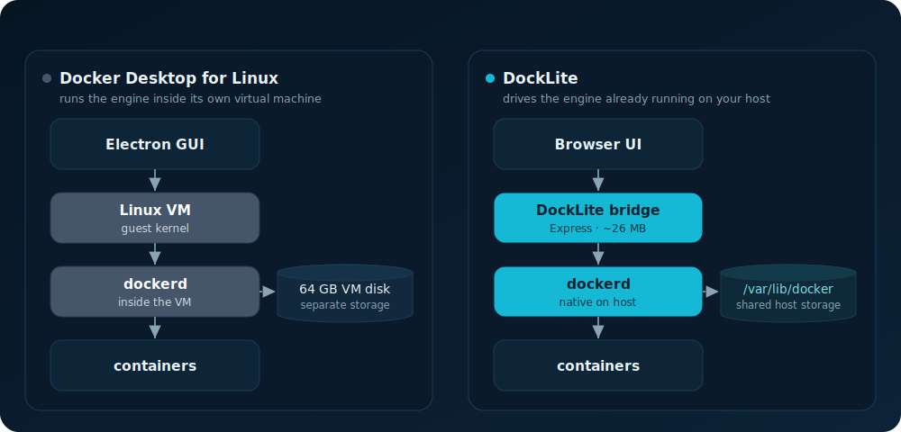
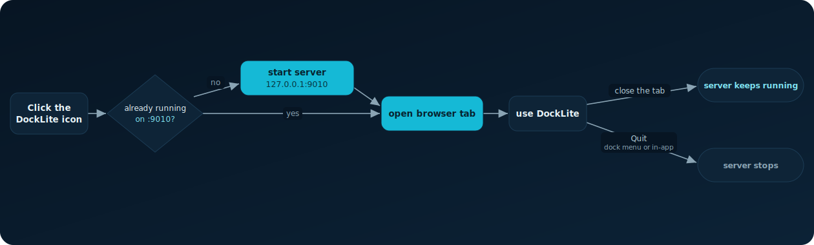

<p align="center">
  
</p>

<p align="center">
  <strong>DockLite</strong> is a browser-based Docker GUI for Linux. It drives the Docker Engine you already
  run, so there is no Electron shell and no virtual machine to boot.
</p>

---

## Why DockLite?

On Linux, Docker Desktop doesn't run Docker directly. It runs it inside its own Linux virtual machine.
That VM is a multi-gigabyte disk image with a second kernel, a second copy of `dockerd`, and its own
isolated image and volume storage. Anything you pull or build is stored inside the VM, kept separate from
the host you actually boot.

Removing it made the cost concrete. A single machine gave back:

```text
/opt/docker-desktop                    the Electron app
/usr/lib/docker/cli-plugins            bundled compose/buildx plugins
/usr/local/bin/com.docker.cli          the desktop CLI shim
~/.docker/desktop                      the 64 GB Linux VM disk image  <-- the big one
```

DockLite takes a different route. It is a small local bridge plus a browser UI that talks to the **native
Docker Engine** (`/var/run/docker.sock`) already on your host. There is no VM to boot and no storage to
duplicate.

<p align="center">
  
</p>

|  | Docker Desktop (Linux) | DockLite |
|---|---|---|
| Runs the engine in | a bundled Linux VM | the native host engine (no VM) |
| Disk footprint | **~64 GB** VM disk image | **~26 MB** installed app |
| Image & volume storage | separate, inside the VM | shared host storage, nothing duplicated |
| Always-on cost | the VM runs whenever Docker is up | just the `dockerd` you already run |
| Interface | Electron desktop shell | your browser |
| Launch model | always-on tray app | on demand; close the tab and the engine stays up |

---

## Architecture

The layer DockLite removes is the point of the whole thing: no guest VM sits between the UI and your
containers.

<p align="center">
  
</p>

A browser can't open `unix:///var/run/docker.sock` on its own, so DockLite ships a thin backend that
exposes a constrained HTTP/WebSocket API to the frontend. That bridge is the only moving part it adds.

---

## Install as a desktop app (Linux)

**Requires Docker** installed and running, with your user in the `docker` group.

### Option A — prebuilt release (no clone, no build)

Grab the portable bundle from [Releases](https://github.com/amali01/docker-lite-web/releases), extract, and
install under `~/.local`. It ships its own Node runtime, so nothing else is needed:

```bash
tar -xzf docklite-portable-x86_64.tar.gz
cd DockLite && ./install-portable.sh
```

Works on x86_64 Linux with glibc ≥ 2.34 (Ubuntu 22.04+, Fedora 35+, and newer).

### Option B — build from this repo

Build a standalone release and install it under `~/.local` with a launcher icon. The installed app runs
independently of this repo:

```bash
pnpm app:install
```

To produce the portable bundle yourself (e.g. to carry to another machine), run `pnpm app:pack` — it emits
`dist-portable/docklite-portable-<arch>.tar.gz`.

<p align="center">
  
</p>

Clicking the **DockLite** icon in your app grid or dock (or running `docklite`) starts the server on
`http://127.0.0.1:9010` if it isn't already up, then opens it in your browser. Close the tab and the
server keeps running. The engine is never touched.

<p align="center">
  
</p>

**Command line**

```bash
docklite          # start if needed, then open the browser
docklite start    # start in the background, don't open a tab
docklite stop     # stop the background server
```

**What it installs**

| Path | Purpose |
|---|---|
| `~/.local/share/docklite/app` | the built frontend and bundled server (replaced on upgrade) |
| `~/.local/share/docklite/data` | credentials and saved engine targets, kept across upgrades |
| `~/.local/bin/docklite` | the launcher command |
| `~/.local/share/applications/docklite.desktop` | app-grid / dock entry, with a **Quit** action |

**Upgrade** by re-running `pnpm app:install`. It stops the old version, swaps in the new build, and
restarts it if it was running. Your data is left in place.

**Uninstall**

```bash
docklite stop
rm -rf ~/.local/share/docklite            # drop this line to keep your data
rm -f  ~/.local/bin/docklite \
       ~/.local/share/applications/docklite.desktop \
       ~/.local/share/icons/hicolor/scalable/apps/docklite.svg
```

---

## Local by default

DockLite is built to run on your own machine, so a fresh install skips the login wall and opens straight
to the dashboard. That shortcut is gated, not blanket:

- The login bypass applies only when the server is bound to a loopback address (`127.0.0.1` or `::1`),
  which is how the desktop launcher runs it. Bind it to anything reachable off-box and login comes back,
  no matter what the setting says.
- You can turn the login wall back on any time in **Settings → Require login**. Re-enabling it revokes
  existing sessions.
- Existing installs keep whatever they had. The new default applies to brand-new installs only.

To reach DockLite from another machine, run it in remote mode with a non-loopback bind. Login is then
enforced automatically:

```bash
DOCKLITE_REMOTE_ENABLED=1 DOCKLITE_HOST=0.0.0.0 pnpm server:dev
```

The first boot seeds an admin from `DOCKLITE_ADMIN_USERNAME` and `DOCKLITE_ADMIN_PASSWORD`, falling back
to `admin` / `admin`. Change both in Settings before exposing the server.

---

## What works

- Engine and system information
- Containers: list, run, start, stop, restart, remove, streaming logs, interactive shell
- Compose projects: grouped view with start, stop, and remove
- Images: list, pull, remove
- Volumes: list, create, remove
- Networks: list, create, remove
- Multiple engine targets (local socket and SSH), switchable from the UI
- In-app **Quit**, and a **mock backend** mode for smoke tests and UI development

---

## Develop

```bash
pnpm install

pnpm dev:mock     # frontend + in-memory backend (no Docker daemon needed)
pnpm dev:full     # frontend + real Docker backend over /var/run/docker.sock
pnpm dev          # frontend only
pnpm server:dev   # backend only
```

`pnpm dev:mock` is the standard testing ground: an in-memory adapter, no daemon required. To run the
frontend and backend together in containers, use `make compose-up` (and `make compose-down` to stop).

**Dependency policy.** Installs are gated by supply-chain rules in `pnpm-workspace.yaml`: package
versions younger than 7 days are refused (`minimumReleaseAge`), and a package whose trust signals weaken
between updates fails the install (`trustPolicy: no-downgrade`). Most npm malware is published and pulled
within days, so the delay means it never reaches this repo. If `pnpm add` rejects a fresh release you
need today, add an exact-version entry to the exclusion list in `pnpm-workspace.yaml` and delete it once
the version clears the window.

Check Docker access before running the real backend:

```bash
./server/scripts/check-docker-access.sh
# if your user can't reach Docker:
sudo usermod -aG docker "$USER"   # then re-login
```

**Validation**

```bash
pnpm lint
pnpm exec tsc -p tsconfig.app.json --noEmit
pnpm server:typecheck
pnpm test
pnpm server:test
pnpm build
pnpm test:e2e
```

---

## Configuration

| Variable | Default | Purpose |
|---|---|---|
| `DOCKLITE_PORT` | `9001` dev, `9010` installed app | server port |
| `DOCKLITE_HOST` | `127.0.0.1` | bind address; a non-loopback value forces login |
| `DOCKLITE_REMOTE_ENABLED` | `0` | serve the built frontend same-origin |
| `DOCKLITE_ADAPTER` | real | set to `mock` for the in-memory adapter |
| `DOCKLITE_ADMIN_USERNAME` / `DOCKLITE_ADMIN_PASSWORD` | `admin` / `admin` | seeded admin credentials |
| `DOCKLITE_AUTH_JWT_SECRET` | generated | JWT signing secret (never commit it) |

Runtime state lives in `server/data/` (`auth-config.json`, `engine-targets.json`, TLS material). It is
generated at startup and gitignored. Never commit it.

---

## Docs

- [Repo Index](./docs/repo-index.md)
- [Product Vision](./docs/product-vision.md)
- [Local Dev](./docs/local-dev.md)
- [Local Docker MVP Plan](./docs/superpowers/plans/2026-03-30-local-docker-mvp.md)
